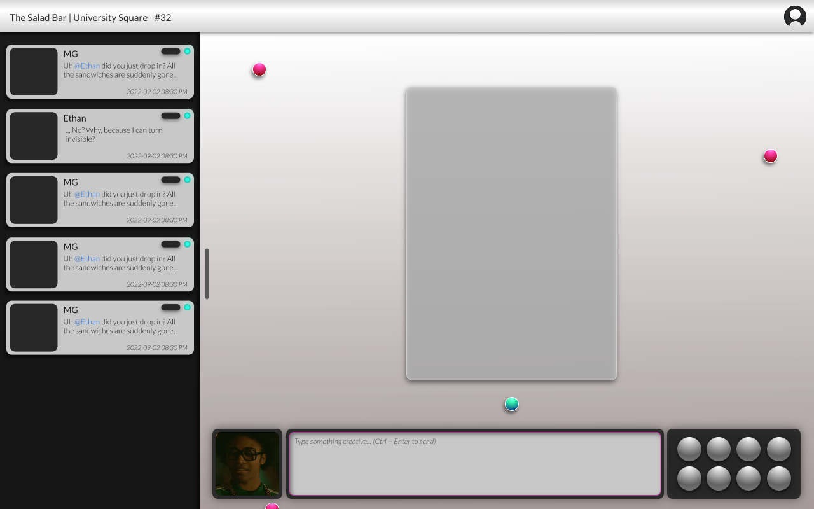
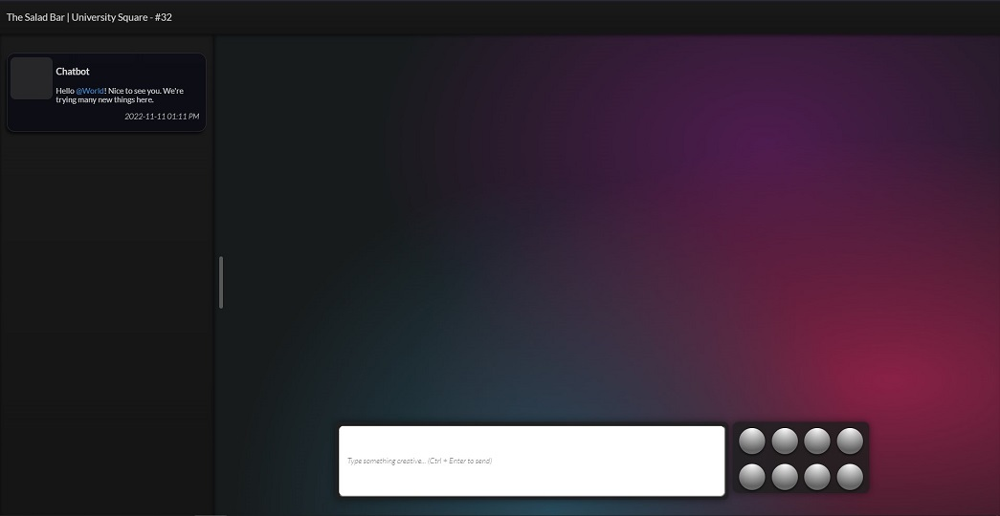

# rmxMUD Prototypes
Concept sandbox for a graphical MUD/MU*-inspired chat system made with React / Remix

## ChatCanvas

Chat system for MUD/text-based games centered around location. Click on points to open menus for hotspots, start a local chat, or interact with objects. Chat history for all messages sent and received are also visible in the tray on the left.

The general idea here is to take a thread of text or other UGC elements and give them a little more context.

Another theme for testing (and dark mode.) Can also click in the "canvas" area to add points and click points to remove them (after a split second.) These points will eventually open up a menu that can contain local chat thread, room features, or other actions.
